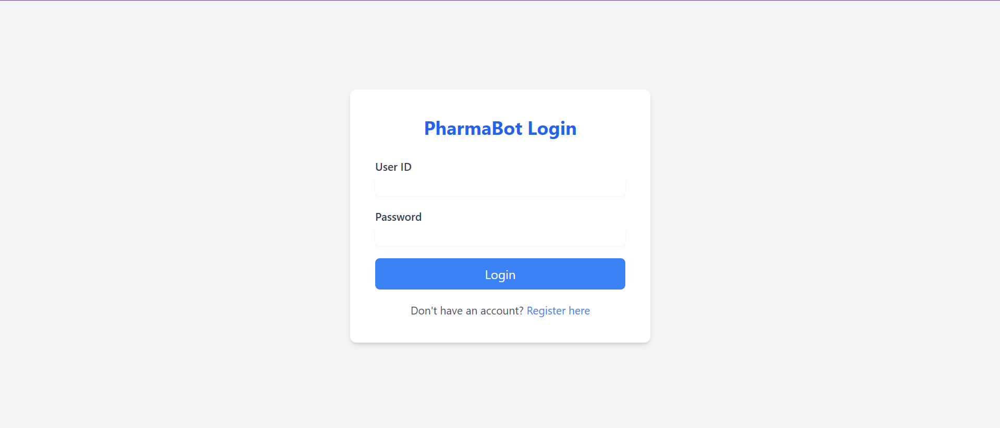
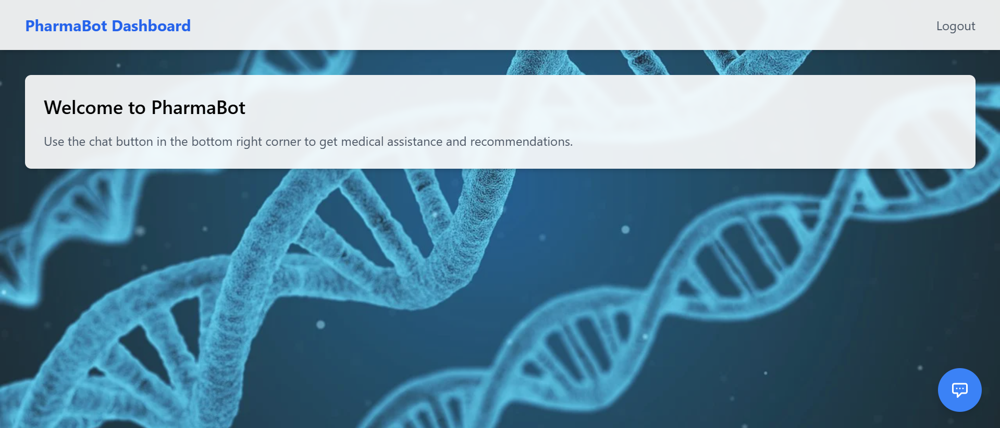

# Pharma Bot

## 🚀 Project Overview

**Pharma Bot** is an intelligent chatbot designed for pharmaceutical assistance. It allows users to register and log in using a **Python Flask** backend with an **SQLite database**. The chatbot responds dynamically using **JavaScript**, and the UI is styled with **Tailwind CSS**.

---

## 🛠 Tech Stack

### Backend:
- **Python** (Flask)
- **SQLite** (Database for authentication)

### Frontend:
- **JavaScript** (Chatbot replies)
- **Tailwind CSS** (Styling)

### Other Tools:
- **Flask-SQLAlchemy** (ORM for database management)
- **Flask-WTF** (Form validation)

---

## 📌 Features
- 🔐 **User Authentication** (Register/Login using SQLite database)
- 💬 **Smart Bot Replies** (Handles pharmaceutical-related queries)
- 🎨 **Responsive UI** (Designed with Tailwind CSS)
- 🔄 **Seamless Backend-Frontend Integration**

---

## ⚡ Installation & Setup

### 1️⃣ Clone the Repository
```sh
git clone https://github.com/iamaftab18/PharmaBot.git
cd PharmaBot
```

### 2️⃣ Set Up Virtual Environment (Optional but Recommended)
```sh
python -m venv venv
source venv/bin/activate  # On Windows: venv\Scripts\activate
```

### 3️⃣ Install Dependencies
```sh
pip install -r requirements.txt
```

### 4️⃣ Run the Flask App
```sh
python server.py
```

### 5️⃣ Open in Browser
Go to: [http://127.0.0.1:5000](http://127.0.0.1:5000)

---

## 🏗 Project Structure
```
pharma-bot/
│── static/
│   ├── dashboard.html   # User Dashboard
│   ├── login.html       # Login Page
│   ├── register.html    # Register Page
│── server.py           # Flask Application
│── pharma.db           # SQLite Database
│── requirements.txt    # Project Dependencies
│── README.md           # Project Documentation
```

---

## 🎯 How It Works
1️⃣ **User registers/login** into the system.
2️⃣ **Flask handles authentication** and stores user data in SQLite.
3️⃣ **User interacts with Pharma Bot**, asking medicine-related queries.
4️⃣ **JavaScript processes responses** and displays them in the chat UI.
5️⃣ **Tailwind CSS ensures a sleek and responsive design.**

---

## 🎨 UI Preview
> 📸 

### 📌 Login Page


### 📌 Dashboard


### 📌 Chat


---

## 🤝 Contributing
Contributions are welcome! If you’d like to improve this project, feel free to:
1. Fork the repository 🍴
2. Create a new branch 🔀
3. Make your changes ✨
4. Submit a pull request 📩

---

## 📜 License
This project is licensed under the **MIT License**.

---

## 📞 Contact
👨‍💻 **Aftab Mulla**  
📧 Email: aftabsm18@gmail.com  
🔗 GitHub: [Your GitHub Profile](https://github.com/iamaftab)  

---

_💙 Thank you for checking out Pharma Bot! Happy coding!_ 🚀

